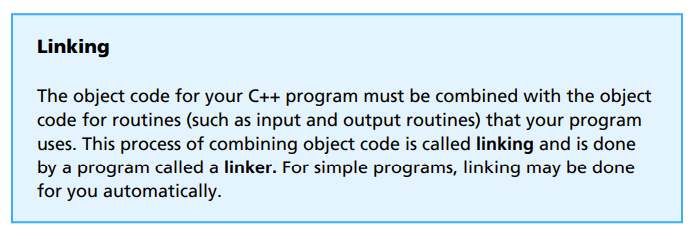

### Chapter 1  答疑
- 答疑问题


  1. cout、cerr和clog
   cout 的内容会先存储在缓冲区中，当收到\n或std::endl或手动刷新后，才会将内容写到文件中，如： /proc/self/fd/1
cerr的内容不会存到缓冲区，会直接存储到文件中，如：/proc/self/fd/2。
因此若程序崩溃中断，有可能cout的内容还在缓冲区，没有被写入文件，但cerr不存在这个问题。
clog有缓冲区，存储路径和cerr相同。。
./main 1>dev/null ：不在终端中打印储存在/proc/self/fd/1中的输出。


  2. main函数 return 0 和 return -1的区别
        ```
        ./main
        echo $?  // $?表示上一个程序的返回值
        ```
        如果main return 0, 则echo的结果为0，如果main return -1，则echo结果为255。

  3. cout 设置格式 操作符
  4. 类若想使用cin,cout,需要输入输出重载 >> 或者 << , 参考14章第二节
  5. 程序运行main之前，会执行所有全局变量的创建，析构在main执行后。也可以通过注册将某些函数的执行提到main函数之前
  6. CMakeList 和 g++的关系：CMakeList生成makefile，makefile调用g++或gcc等编译器来生成程序。CMakeList的好处在于封装方便。编译的全局变量只属于g++或gcc,只不过相当于CMakeList层层传参，头文件的链接也是g++等编辑器完成。
  7.  问：makefile中全局的宏定义没有在CMakeList中找到，这种宏定义如何设置？
    答：CMakelist中的都会对应到makefile中的定义。
  8. CMakeList中的变量可以通过message命令查看c

  9.  编译的四个阶段：预处理、编译、汇编、链接


   


  10. 链接：


   


- 代办问题
  1. CPU和GPU的内存调用耗时问题？以及文件读写的底层机理？
  2. std::cin 的解析规则
  3. 如何判断CMakeList中该使用INCLUDE_DIR 还是INCLUDE_DIRS？
