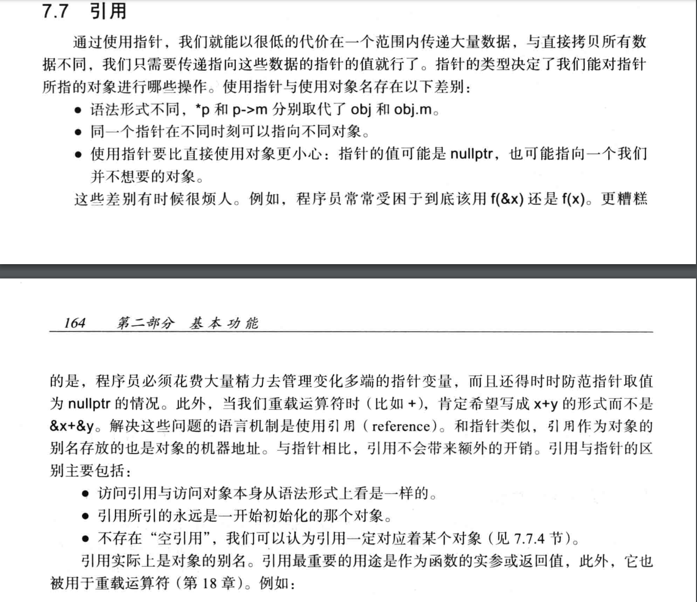

### Chapter 2  答疑
- 答疑问题


  1. P33 表格2.1 为什么float和double是6-10位有效数字？与P34页的7和16位冲突，同时印象中应该是7和16是对的。
    答：与编译器相关

  2. 指针相等的判定？不得其解
    答：指针相等的判定就是指针存的地址值是否相等。

  3. 含有无符号数的表达式(建议不要这样，如果必须需要static_cast强制类型转换)
     3.1 当表达式中既有无符号又有int时，int值会被转换成无符号数

        ```
        unsigned u = 10;
        int i = -42;
        std::cout << static_cast<int>(u) + i << std::endl; // 如果int占32位，输出4294967264
        ```

      3.2 当从无符号数中减去一个值，可能会出现数值问题
        ```
        unsigned int u1 = 42, u2 = 10;
        std::cout << u2-u1 << std::endl; //输出4294967264
        ```

  4.   嵌套的作用域（练习2.14）
        ```
        以下程序是否合法？如果合法，会输出什么？

        int i = 100,sum = 0;
        for(int i = 0; i != 10; i++)
        {
            sum += i;
        }
        std::cout << i << " " << sum << std::endl;

        答：合法。输出100，45；for循环内部是内层作用域，在for循环内部i被重新定义，并不算重定义。
        ```
        For 循环本身就可以看成是新的作用域，即可以将for(;;)的三条语句认为编译器会解析成{}；
  5. Const 与指针 （区别技巧：从右向左读）
   5.1 指针指向的值不可通过指针p修改
      ```
      1）const int *p;
      2）int const *p;
      ```

      5.2 指针指向的地址不可修改
      ```
      int *const b = &a; //
      ```

      5.3 指向常量的指针常量就是一个常量，且它指向的对象也是一个常量。
      ```
      const int a = 25;
      const int * const b = &a;
      ```
  6. 声明（declaration）与定义（definition）的区别：声明使得名字为程序所知；定义负责创建与名字关联的实体。（在头文件声明的变量仅仅是声明 @yangms@zhaofy 解释清楚）
  7. const引用可以绑定到右值
  8. 每个用了const对象的文件都必须能够访问到它的初始值

  9. const int& x 可以传入数值常量，int& x 不可以传入数值常量

  10. 问题：如何理解顶层const和底层const
          杨老师答：顶层const和底层const只是书中便于理解做的定义，实际编程过程中只需要理解“const int* const * p”这种定义的实际意义即可。而对于这种定义，在理解的时候只需要记住一个原则即可——从里向外读，从右向左读。
  11. 创建类时，无参构造函数任何时候都可以省略吗？
       如果创建一个类，没有写任何构造函数，则系统会自动生成默认的无参构造函数，且此函数为空。
    但是只要有其他的构造函数，系统就不会再自动生成这样一个默认的构造函数。如果希望有一个这样的无参构造函数，则需要显示地写出来。
  12. 创建类时的注意事项
   1）合理区分公/私有成员和公/私有成员函数
   2）成员函数作用仅为Get成员的值时，定义函数时标明const。且为了增加可读性，尽量直接返回该成员。

  14. 关于声明和定义：关于声明和定义，大家可以读《C++程序设计语言  第1-3部分》（路径：[/cpp_primer/book/](https://xiaopeng.feishu.cn/drive/folder/fldcnEok30BPHEiFbUd09hcdCTh)）的6.3章节 和15章；这本书是C++之父写的，可以更好的理解背后的设计理念
   
