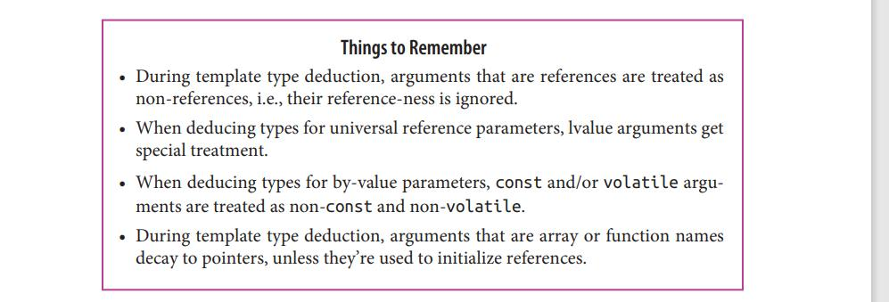
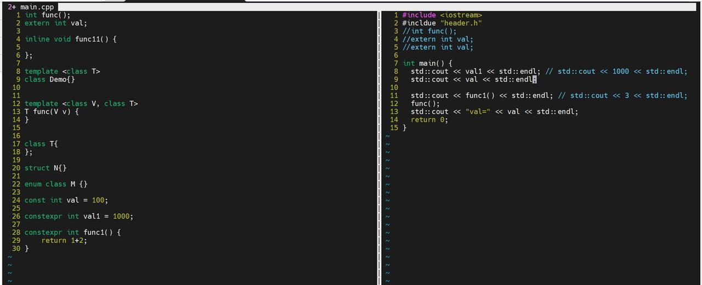
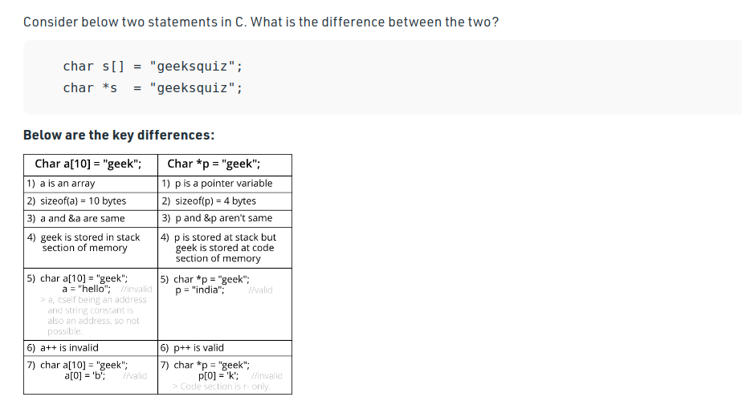

### Chapter 2  答疑
- 答疑问题


  1.  const、constexpr 和宏定义
    宏定义：在预处理阶段展开，没有类型，不做类型检查，仅仅是展开。
    constexpr: 在编译期使用常量替换掉变量
    const并未区分出编译期常量和运行期常量

  2. String的存储方式 ：SSO 短的字符串（算上‘\0’小于等于16个字符）在栈上，长的字符串在堆上

  3. 不管string的长度是多少，sizeof(string)始终等于32。（里面存的是指针,32与编译器相关)

  4. 编译单元：不同的cpp即不同的编译单元

  5. 使用变量之前必须先声明，使用其他编译单元中定义的（全局）变量前先使用extern声明

  6. header-only的库将时间消耗放在编译期，编译期更轻量化

  7. 为什么内联函数可以解决多重定义的问题？
      单一定义规则：一个类、模板或内联函数的两个定义是可以被接受、被认为是相同唯一定义，当且仅当如下条件成立：
      1，他们出现在两个不同的编译单元中，且
      2，他们的源码逐单词对应，完全一样，且
      3，这些单词在两个编译单元中的含义完全一样。

  8. 范围for循环中，" ："取得是“ ：”号后面数组中的元素

  9. vector和string的size()函数，返回值得类型是size_type类型，这一类型与平台有关

  10. 常用的二进制符号检查工具：nm readelf objdump

  11. 类型推断
    

  12. 建议放在头文件的类型：
   

  13. 生存周期建议大家参考https://github.com/Sunriseyms/cpp_improve_class/tree/main/cpp_primer/Q%26A/chapter_2/declare_and_definition 好好体会

  14.  表3.7 iterator +_n 表述有问题，迭代器和指向数组的指针行为类似，如果n过大可能会超出数组范围,但是不会报错，故使用时需判断begin()或者end().
   ```
   #include <iostream>
  #include <vector>
  using namespace std;

  int main()
  {
    vector<int> vec{1,2,3};
    std::cout << &(*(vec.begin()-2))<< std::endl;
    std::cout << &(*(vec.begin()-1))<< std::endl;
    std::cout << &(*(vec.begin()))<< std::endl;
    std::cout << &(*(vec.begin()+10))<< std::endl;
    return 0;
  }

  输出：
  0xadcea8 //地址连续，但是不会判断该地址是否处于vector中，即不会判断是否合法
  0xadceac
  0xadceb0
  0xadced8
   ```

  15. vector 访问元素的两种方式：vec[i] 与vec.at(i)
   杨老师强调一定要判断size！三遍！再额外三次！
   ```
   建议使用：
  for(auto elem : vec){}

  当然以下都可以：
  for(auto it = vec.begin(); it != vec.end(); it++){}

  for(int i = 0 ; i < vec.size(); i++){
      vec[i] = i;
      //svec.at(i) = i; vec.at(i)超限会抛出异常，但是存在一定的开销。
  }
   ```

  16. 杨老师再次强调，多个运算符一定要加括号！一定要加括号！一定要加括号！
  17. 如果是Const string str = "ABC" ， begin() 返回的是const_iterator
   ```
   const string str = "ABC" ；
  auto beg = str.begin(); // 返回的是const_iterator

  string str2 = "ABC";
  auto beg2 = str.begin(); // 返回的是iterator

  begin()函数本身有重载，两个版本：
  iterator begin() {}
  const_iterator begin() const {} // this本身是const，返回const_iterator保护const特性
   ```

  18. char * vs char[]
   https://www.geeksforgeeks.org/whats-difference-between-char-s-and-char-s-in-c/
   
